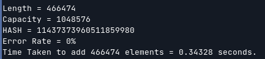
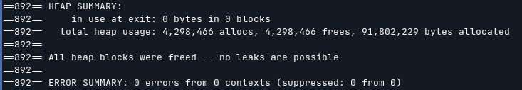

* # MAP: The Safe C/C++ Map / Linked List Library 
	* #### **Safe map in C/C++, with huge amount of in-built functions.**
	* #### **This library has 19 pre-defined functions.**
	* #### **This library can be used in both C and C++.**
	* #### This header file is *cross-platform*, but tested only on Windows 10, Windows 11, Arch Linux, Debian Linux, WSL 2 only. (But will work on macOS also). *And checked memory leak using **`valgrind`** in which (19/19) functions passed.*

* # Functions Defined v:1.6.6
```
add(key, value)
add(node<key, value> *)
add(node<key, value> &)
remove
contains
get
get_node
get_index
erase
sort_key
sort_values
empty
length
capacity
error_rate
iterator
hash
compare
comapre_hash
max_depth
```
* # SOME RESULTS:
	* #### Added 466474 words from the dictionary to the map, with 0% error rate, 0 memory leaks and 0 errors from valgrind. On a Intel Core i5-7200U CPU @ 2.50 GHz processor with 8GB RAM, it took only 0.34 seconds to add the dictionary to the map.
	* 
	
	* 
* # BUILD
	* #### **For testing use:** *`g++ -g -W -Wall -Wextra -std=c++20 ./samples/test.cc -o test` **and then** `valgrind --leak-check=full --show-leak-kinds=all --track-origins=yes --verbose --log-file=valgrind-out.txt ./samples/test "Hello" "World" "123" "map"`*
* # Installation
	* #### To install on *arch linux* use **`PKGBUILD`**.
	* #### To install on **any Operating System** use:
		* #### [**GUI** Download Jar File (Cross-Platform)](https://github.com/Dark-CodeX/InstallRepos/releases/download/v1.1.0/InstallReposGUI.jar)

		* #### [**CLI** Download Jar File (Cross-Platform)](https://github.com/Dark-CodeX/InstallRepos/releases/download/v1.1.0/InstallReposCLI.jar)
